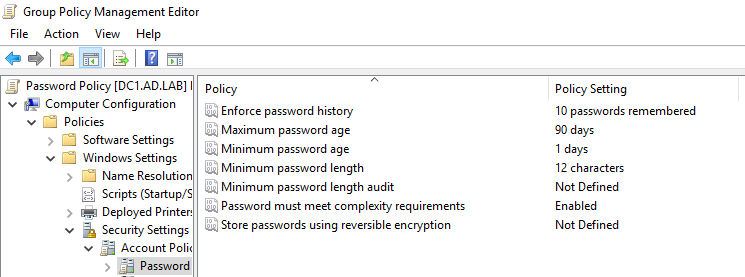
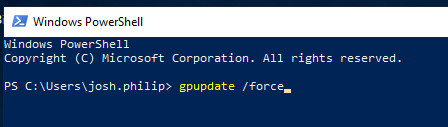
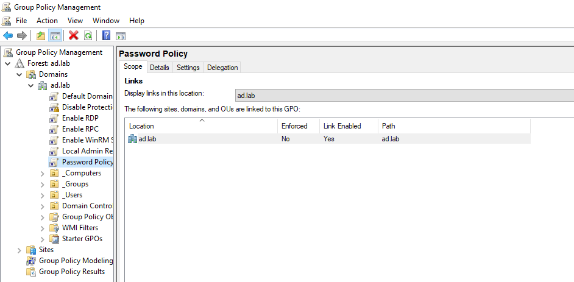

## Overview

After creating the OUs, I chose to implement group policies such as **Password Policy** and **Account Lockout** for all users in the domain. This was achieved using the Windows Active Directory **Group Policy Management** software.

## Why this matters?

Group Policy Objects allow for centralized management and security for all devices in the domain, which is extremely useful in large scale environments with thousands of users and workstations. GPOs ensure password configurations are consistent across users, automated software is streamlined, and baseline security throughout the domain is achieved.

## Steps:
1. Create a GPO named "Password Policy" under ad.lab in **Group Policy Management**
2. Set the desired values for the fields in both Password Policy and Account Lockout Policy, just beneath Password Policy (see Screenshot 1 below for example)
3. On Windows PowerShell, run `gpupdate /force` to apply the changes in policies

## Screenshots:

*Screenshot 1: The values set for the custom **Password Policy** GPO*

*Screenshot 2: Running the `gpupdate /force` command on Windows Powershell*

*Screenshot 3: Tab displaying the Password Policy GPO being linked to the ad.lab domain*

## Issues:

No issues were encountered in this portion of Phase 1.
