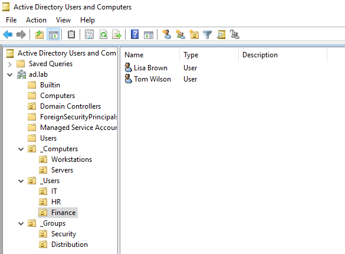
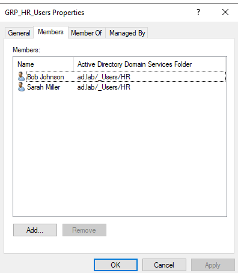

## Overview

Created a custom OU (Organizational Unit) structure in Active Directory Users and Computers (ADUC) to organize users, computers and groups by department.

## Groups and Members

| Group | Users |
| :--- | :--- |
| GRP_IT_Admins | John Smith (j.smith), Jane Fisher (j.fisher) |
| GRP_HR_Users | Bob Johnson (b.johnson), Sarah Miller (s.miller) |
| GRP_Finance_Users | Tom Wilson (t.wilson), Lisa Brown (l.brown) |

## Why this matters?

OUs allow Group Policy to be applied in a granular fashion to specific departments rather than the entire domain. Without OUs, you lose the ability to precisely delegate control or target policies.

## OU Structure
```text
ad.lab
├── _Computers
│   ├── Workstations
│   └── Servers
├── _Groups
│   ├── Security
│   └── Distribution
└── _Users
    ├── IT
    ├── HR
    └── Finance
```

## Screenshots


*Screenshot 1: The expanded tree of the ad.lab domain, showing the OUs*



*Screenshot 2: The **Members** tab of the GRP_HR_Users OU displaying members*

## Issues

When I tried to create an OU for **Computers**, that name already exists as one of the default containers in Active Directory. This was resolved using the underscore (_) naming convention before the name, making it **_Computers** instead. For consistency purposes, all custom made OUs were prefixed with underscores.
