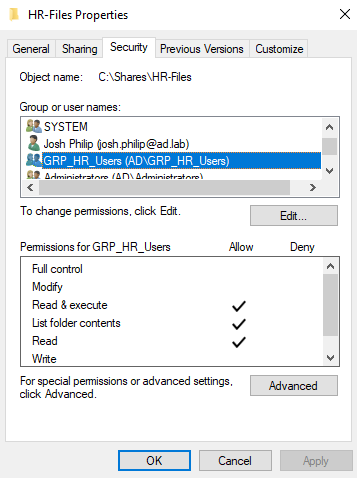
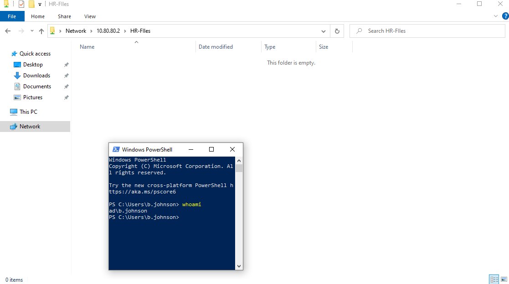
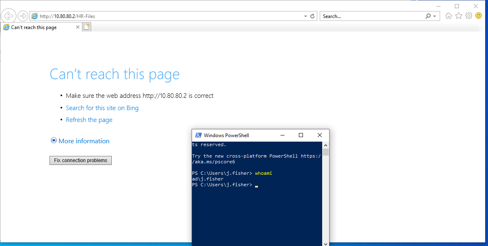

## Overview:

Created a shared folder for one of the groups, **HR**, and verified if a user in that group is able to access the shared folder from their joined VM.

## Why this matters?

Shared Folders allow for efficient, centralized file storage, enhancing security permissions, and allowing streamlined collaboration between team members. Shared folders are one way for access control to be easily managed in Windows, allowing organizational groups to securely control who can edit, view or delete sensitive data.

## Steps:
1. Create a new folder in the Domain Controller in the C Drive (C:\\) and name it `Shares\HR-Files`
2. Set up the permissions for this folder in the **Advanced Sharing** tab of Properties, add `GRP_HR_Users` as the members instead of `Everyone`, give the group **Read** access.
3. Go to the **Security** tab and give the following NTFS (New Technology File System) permissions: Read, Write & Execute
4. Sign in as an HR user (i.e. **b.johnson**) on one of the Windows 10 Enterprise VMs and try to access the shared folder at `\\10.80.80.2\HR-Files`
5. Sign in as a non-HR user and try to access the shared folder at `\\10.80.80.2\HR-Files`

## Screenshots:

*Screenshot 1: Security tab of the `C:\\Shares\HR-Files` folder*

*Screenshot 2: An HR user successfully accessing the shared folder*

*Screenshot 3: A non-HR user unable to access the shared folder*

## Issues:
No issues were encountered during this section of Phase 1
