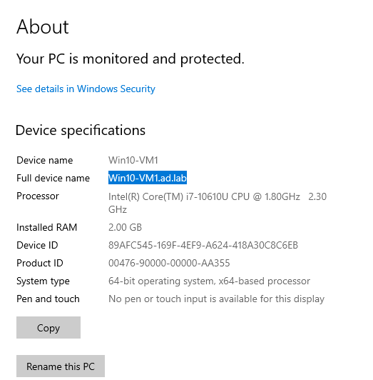
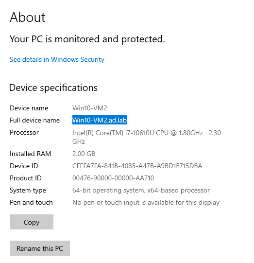
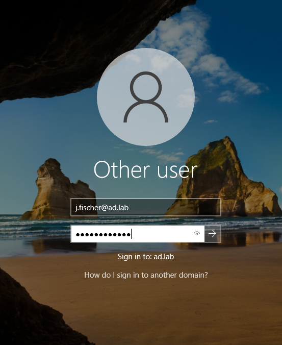

## Overview:

Joined the Active Directory User VMs (both running Windows 10 Enterprise) to the ad.lab domain. 

## Why this matters?

As previously mentioned in earlier writeups, the point of Active Directory is to ensure centralized management of devices, enhanced security, and streamlined access to network resources, transforming ordinary computers into valuable corporate assets.

## Steps:
1. Set the Domain Controller (DC) as the DNS server for the Windows 10 VMs by setting the **Preferred DNS server** to 10.80.80.2 (DC's IP) in the VM's Adapter settings.
2. Join the domain by opening the **System** page in the start menu, selecting the `Domain` option, then typing **ad.lab**
3. Restart the VM, then log in as any domain users previously created with their login credentials. If successful logon, the VM successfully joined the domain.

## Screenshots:

*Screenshot 1: Windows 10 Enterprise VM 1 joined the ad.lab domain*

*Screenshot 2: Windows 10 Enterprise VM 2 joined the ad.lab domain*

*Screenshot 3: Signing into domain-joined machine, indicating the domain name below login fields*

## Issues:

No issues were encountered in this portion of Phase 1
