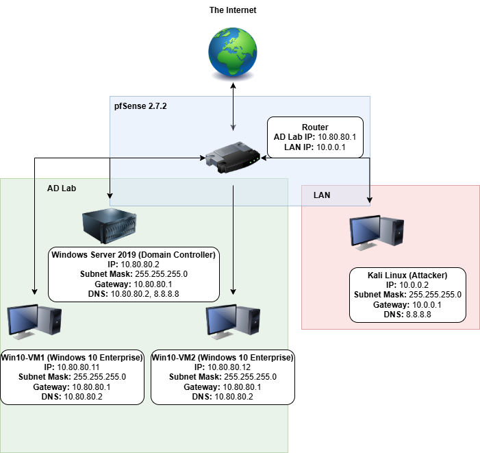

# Active Directory Homelab
Windows Server 2019 Active Directory lab documenting OU design, Group Policy, privilege management, and attack/defense exercises including Kerberoasting, BloodHound and Pass-the-Hash.


## Overview
This homelab simulates a real-world Active Directory environment built from scratch on VirtualBox. The goal is to develop and demonstrate hands-on skills in AD administration, security hardening, and offensive/defensive security techniques used in enterprise environments.

This project is structured in three phases - administration, hardening, and attack/defense. Each phase will consist of full documentation, screenshots and write-ups.

## Lab Environment

| Component | Details |
| :--- | :--- |
| **Hypervisor** | Oracle VirtualBox |
| **Domain Controller** | Windows Server 2019 |
| **Workstations** | 2x Windows 10 Enterprise (domain joined) |
| **Attack Machine** | Kali Linux |
| **Domain** | 'ad.lab' |
| **Users** | Simulated AD users via [vulnadplus.ps1](https://raw.githubusercontent.com/WaterExecution/vulnerable-AD-plus/master/vulnadplus.ps1) |

## Network Topology


## Project Structure

```text
active-directory-homelab/
├── Phase1-Administration/
│   ├── ou-structure.md
│   ├── gpo-configurations.md
│   ├── user-group-management.md
│   ├── shared-folders-permissions.md
│   └── screenshots/
├── Phase2-Hardening/
│   ├── hardening-checklist.md
│   ├── audit-policy-config.md
│   ├── event-log-analysis.md
│   └── screenshots/
├── Phase3-Attack-Defend/
│   ├── kerberoasting.md
│   ├── asrep-roasting.md
│   ├── bloodhound-analysis.md
│   ├── pass-the-hash.md
│   ├── dcsync.md
│   └── screenshots/
├── Reports/
│   └── AD-Security-Assessment.pdf
└── README.md
└── assets
    └── network-topology.png
```

## Phase 1 - AD Administration

**Goal:** Build and manage a functional Active Directory environment from the ground up.

**Completed Tasks:**
- [x] Designed and created OU structure (IT, HR, Finance)
- [x] Created domain users and security groups
- [x] Applied Group Policy Objects (password policy, lockout policy, drive mapping)
- [x] Joined Windows 10 VMs to the domain
- [x] Configured shared folders with NTFS and share permissions
- [x] Tested permission-based access across user accounts

**Writeups**:
[OU Structure](Phase1-Administration/ou-structure.md) | [GPO Configurations](Phase1-Administration/gpo-configurations.md) | [User & Group Management](Phase1-Administration/user-group-management.md)

## Phase 2 - Security Hardening

**Goal:** Identify and reduce the attack surface of the AD environment.

**Completed Tasks:**
- [ ] Audited privileged accounts and Domain Admins group
- [ ] Disabled legacy protocols (NTLM, SMBv1) via GPO
- [ ] Configured Fine-Grained Password Policies for admin accounts
- [ ] Enabled and configured audit policies (logon, account management, privilege use)
- [ ] Deployed Sysmon for enhanced event logging
- [ ] Reviewed key Event IDs: 4624, 4625, 4648, 4720, 4732

**Writeups**: [Hardening Checklist]() | [Audit Policy Config]()

## Phase 3 - Attack & Defend

**Goal:** Simulate common AD attacks, detect them via logs, and remediate the underlying vulnerabilities

| Attack | Tool | Status |
| :--- | :--- | :--- |
| Password Spraying | CrackMapExec | Pending |
| Kerberoasting | Impacket/Rubeus | Pending |
| AS-REP Roasting | Impacket | Pending |
| BloodHound Enumeration | BloodHound + SharpHound | Pending |
| Pass-the-Hash | Mimikatz | Pending |
| DCSync | Mimikatz | Pending |

**Writeups:** (*Note*: Each writeup follows the format: **Attack->Evidence in Logs->Detection->Remediation**)


[Kerberoasting]() | [BloodHound Analysis]() | [Pass-the-Hash]()

## Final Report

A formal security assessment report documenting all findings, evidence, and remediations - modeled after a real-world pentest deliverable.

[Report (PDF)]()

## Tools Used

| Tool | Purpose |
| :--- | :--- |
| VirtualBox | Hypervisior/lab environment |
| Windows Server 2019 | Domain Controller |
| Kali Linux | Attack Machine |
| BloodHound CE | AD attack path visualization |
| Impacket | AD attack scripts |
| Mimikatz | Credential extraction |
| CrackMapExec | Network enumeration and spraying |
| Sysmon | Enhanced Windows event logging |
| draw.io | Network diagrams |

## Skills
* Active Directory administration (OUs, GPOS, users, groups)
* Group Policy design and enforcement
* NTFS and share permission management
* Windows Event Log analysis
* AD attack techniques (Kerberoasting, PTH, DCSync, BloodHound)
* Blue team detection and incident response
* Security hardening and remediation
* Technical documentation and reporting

### About
This homelab is built as a self-directed project to develop practical skills for roles in **sysadmin, IT Security** and **blue/red team** environments

Connect with me on [LinkedIn](https://www.linkedin.com/in/josh-e-philip/) | [GitHub](https://www.github.com/joshphil-cyber)
